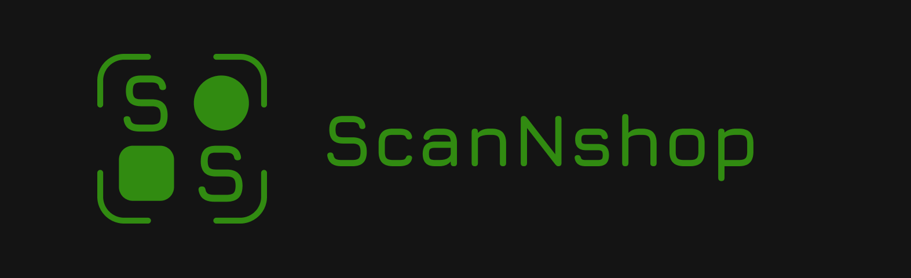
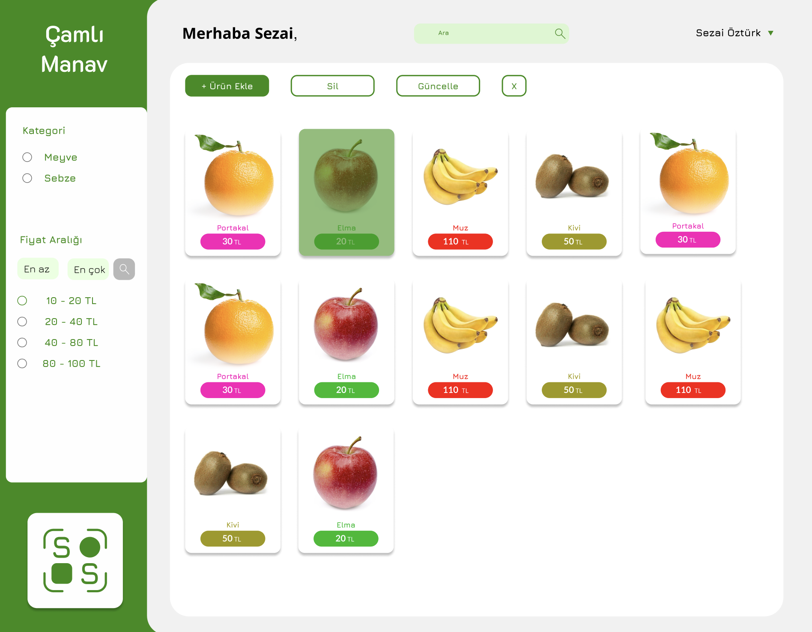

# ScanNShop Web Uygulaması

## Hakkında
ScanNShop, firmaların ürün bilgilerinin kullanıcılara ulaşmasını sağlayan bir web uygulamasıdır. Bu proje, benzer ürünleri tanımlamak ve bulmak için ResNet modelini kullanır.

## Özellikler
- Ürün tarama ve fiyat karşılaştırma
- ResNet modeli ile görüntü işleme
- Node.js ve Express.js kullanarak CRUD işlemleri
- Veri tabanı olarak MongoDB
- Backend geliştirme: Node.js ve Express.js
- Frontend geliştirme: React

## Kullanılan Teknolojiler
- **Frontend:** React
- **Backend:** Node.js, Express.js
- **Veri Tabanı:** MongoDB
- **Görüntü İşleme:** ResNet modeli

## Ekran Görüntüleri

